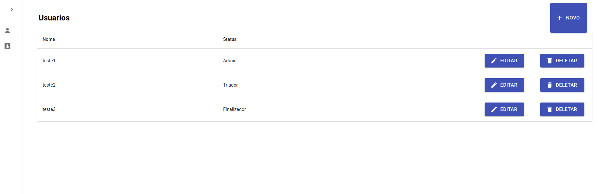
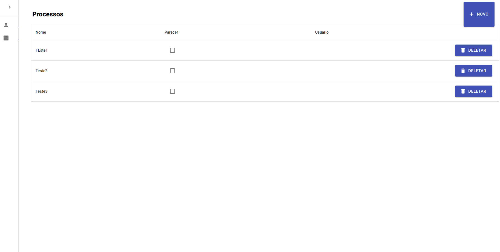

# CRUD processos e usuarios.

projeto simples de crição de usuarios e processos com front end desenvolvido em React e back end desenvolvido em java.

## Passos para rodar o projeto:

1. abrir o projeto "backend" no Intellij ou Eclipse
2. atualizar pacotes do maven com Maven Install
3. Iniciar o servidor java
4. abrir terminal e acessar a pasta "frontend"
5. instalar dependencias com `yarn install`
6. iniciar dev server com `yarn start`

## Dependencias 

* Nodejs
* Intellij ou Eclispe
* yarn

## Imagens

